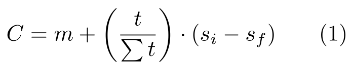
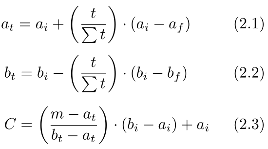

<!-- README.md is generated from README.Rmd. Please edit that file -->

```{r, echo = FALSE}
knitr::opts_chunk$set(
  collapse = TRUE,
  comment = "#>",
  fig.path = "README-"
)
```

# driftR  

[](https://travis-ci.org/shaughnessyar/driftR)
[](https://ci.appveyor.com/project/shaughnessyar/driftR)
[](https://codecov.io/gh/shaughnessyar/driftR)
[](https://cran.r-project.org/package=driftR)

The goal of driftR is to correct continuous water-quality monitoring data for intramental drift.

## Installation

You can install driftR from github with:

```{r gh-installation, eval = FALSE}
# install.packages("devtools")
devtools::install_github("shaughnessyar/driftR")
```

## Background




## Usage

As shown, continuous water-quality instrument drift over time, so it becomes necessary to correct the data to maintain accuracy. First, you start with importing the data with `dr_readSonde()`. Next, you apply a correction factor using `dr_correct()`. Then, utilizing the generated correction factors, you use either `dr_clean1()` or `dr_clean2()` to drift correct the data using 1 or 2 point calibrations respectively. Lastly, you would `dr_drop()` data to account for instrument equilibration. 

```{r example}
#library(driftR)

#dataFrame <- dr_readSond("~/filePath/data.csv", define=TRUE)
#correct <- dr_correct(dataFrame, Date, Time, format=YMD)
#dataFrame$SpCond_clean <- dr_clean1(df, SpCond, 1.07, 1, correct)
#dataFrame <- dr_drop(dataFrame, head=10, tail=5)

#(plot funtion w/ graph to show raw vs. corrected data)
```

## Contributor Code of Conduct
Please note that this project is released with a Contributor Code of Conduct (CONDUCT.md). By participating in this project you agree to abide by its terms.
