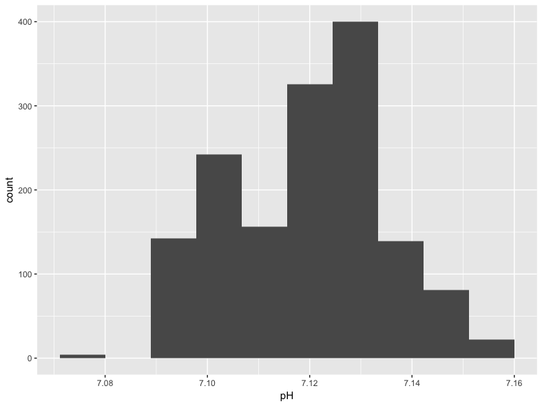
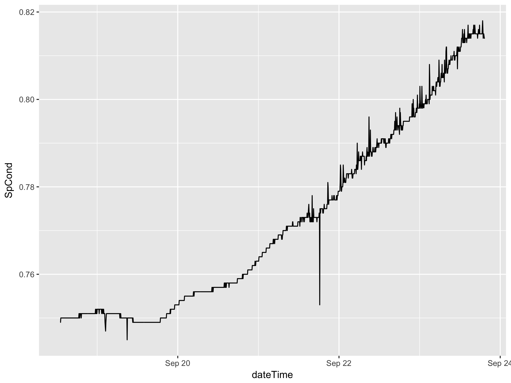
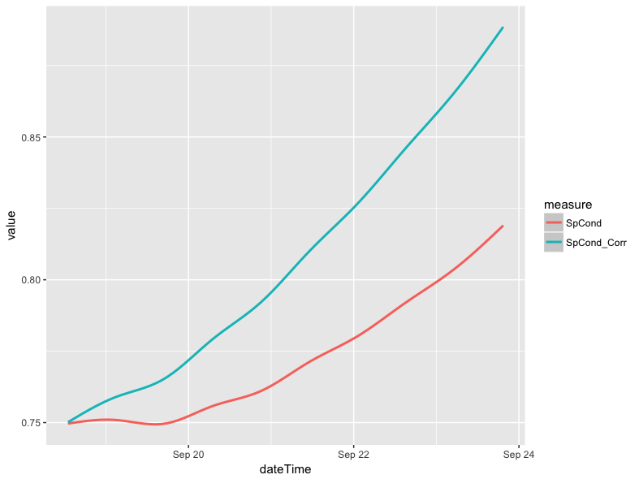
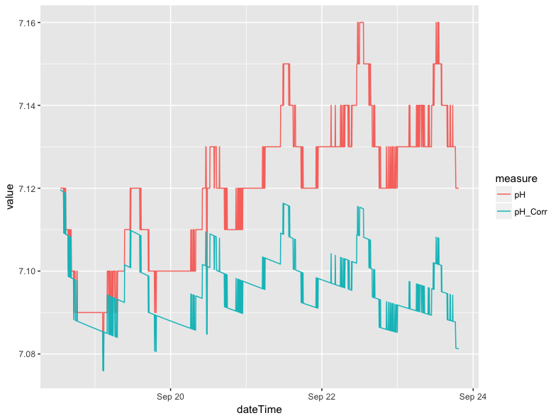
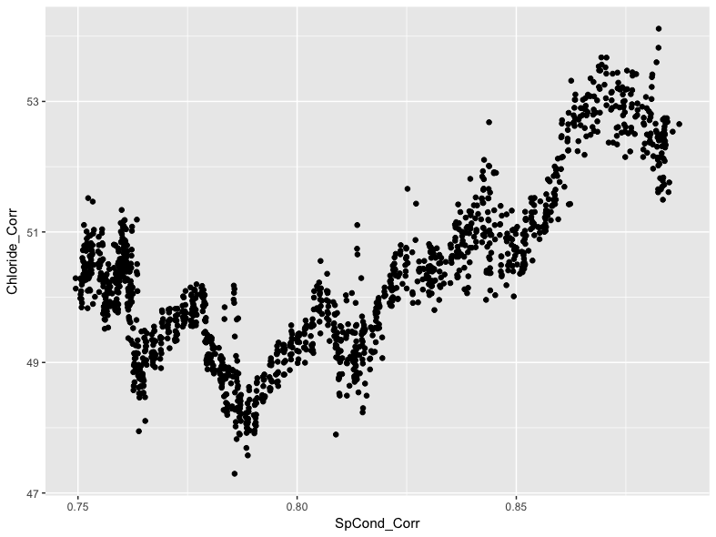
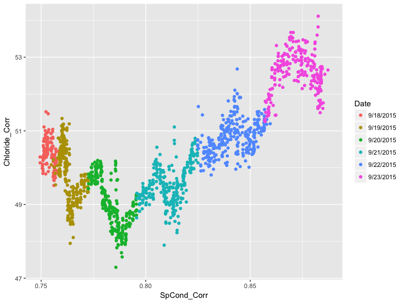
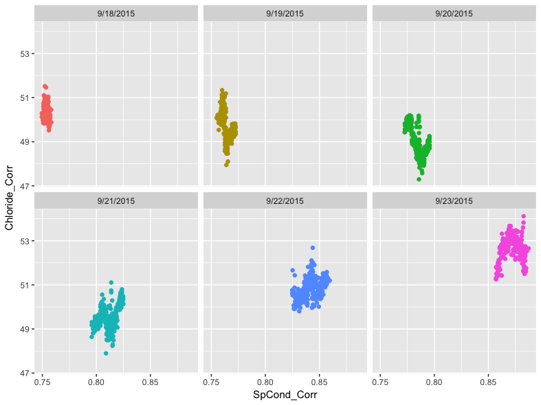
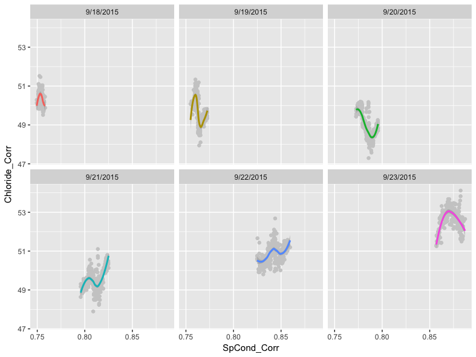
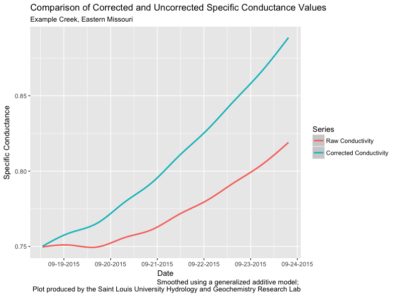

Once data have been corrected using `driftR`, `R` provides a host of tools for exploring them. This article will quickly cover a few techniques for both doing exploratory data analysis using [`ggplot2`](http://ggplot2.tidyverse.org) and obtaining some basic descriptive statistics. This article assumes you have completed cleaning the example data included in this package (see the [Getting Started](driftR.html) vignette).

## Packages

The packages that we will use, beyond the `base` package, are all a core part of the [`tidyverse`](https://www.tidyverse.org):

* [`ggplot2`](http://ggplot2.tidyverse.org) - a set of tools for implementing the [Grammar of Graphics](http://vita.had.co.nz/papers/layered-grammar.pdf)
* [`dplyr`](http://dplyr.tidyverse.org) - a set of common verbs for cleaning and wrangling data
* [`tidyr`](http://tidyr.tidyverse.org) - functions for consistently tidying data so that "(1) each variable is in a column, (2) each observation is in a row, and (3) each value is a cell"
* [`stringr`](http://stringr.tidyverse.org) - a set of functions for manipulating string (text) data

## Reading and Binding Data

Following the [Getting Started](driftR.html) vignette, we assume that data are stored on your computer in `csv` format. To open these data in `R`, we recommend using the [`readr` package's](http://readr.tidyverse.org) [`write_csv()`](http://readr.tidyverse.org/reference/write_delim.html) function:

```{r, eval=FALSE}
df <- read_csv("waterData.csv")
```

Using `read_csv()` ensures that data are brought back into `R` as [tibbles](http://tibble.tidyverse.org). Tibbles are the [`tidyverse`](https://www.tidyverse.org) implementation of data frames. They print in a more organized manner and they behave in a more stable fashion.

If you have multiple tables to read in and combine, use as many instances of `read_csv()` as necessary and then the [`dplyr` package's](http://dplyr.tidyverse.org) [`bind_rows()` function ](http://dplyr.tidyverse.org/reference/bind.html) to combine them:

```{r, eval=FALSE}
df1 <- read_csv("waterData_Jan17.csv")
df2 <- read_csv("waterData_Feb17.csv")

df <- bind_rows(df1, df2)
```

Make sure that each data frame has identically named and formatted columns before binding. If changes need to be made, see our [article on bringing data in from other sources](OtherData.html).

## Descriptive Statistics

The `base` package, which is part of the "base" `R` distribution that users typically download from CRAN or one of its mirrors, can be used for obtaining basic descriptive statistics. In particular, the `summary()` function provides a number of useful statistics including range, median, and mean:

```{r, eval=FALSE}
> summary(df$SpCond)
   Min. 1st Qu.  Median    Mean 3rd Qu.    Max. 
 0.7450  0.7520  0.7670  0.7719  0.7900  0.8180 
> summary(df$SpCond_Corr)
   Min. 1st Qu.  Median    Mean 3rd Qu.    Max. 
 0.7495  0.7677  0.8018  0.8067  0.8422  0.8872 
```

## Exploratory Data Analysis

[Exploratory data analysis](https://en.wikipedia.org/wiki/Exploratory_data_analysis) (EDA) is a set of techniques promoted by [John Tukey](https://en.wikipedia.org/wiki/John_Tukey) for visually assessing data sets. `ggplot2` and the tidyverse make it easy to conduct EDA on your data. You will need to have each of the packages listed below loaded in your `R` session:

```{r, eval=FALSE}
library(ggplot2)  # data visualization
library(scales)   # date/time scales for plots

library(dplyr)    # data wrangling
library(tidyr)    # reshaping data
library(stringr)  # tools for strings
```

## Histograms

Histograms are a classic way to assess the shape of the distribution of a single variable. They also make for an easy introduction to `ggplot2`. Every `ggplot2` call has at least two components, including an initial `ggplot()` function and a "geom" that defines the way the underlying data are transformed for plotting purposes:

```{r, eval=FALSE}
ggplot(data = df) +
  geom_histogram(mapping = aes(x = pH), bins = 10)
```

We assign the *data source* in `ggplot()` and describe the *aesthetic mapping* (the connection of data to visual properties) in the `geom_histogram()` call. The code shown above will produce this plot of the distribution of pH values:



## Visualizing Drift over Time

The key feature of `driftR` is the correction of instrament drift that occurs over time. We can visualize this change in our data with a few additional steps. Before we create the plot, we need a variable that combines our `Date` and `Time` data created by `dr_read()`. We need to concatenate these two variables together using `str_c()`, and then store them as properly identified date-time data (which `R` calls `POSIXct`) using `as.POSIXct()`. These changes are both made using the [`mutate()`](http://dplyr.tidyverse.org/reference/mutate.html) function from [`dplyr`](http://dplyr.tidyverse.org), which allows us to create new variables. Once we have a date-time variable, we can use it as the `x` variable on our plot and plot a measure like specific conductance (`SpCond`) against it using the `geom_line()` geom from `ggplot2`:

```{r, eval=FALSE}
df %>%
  mutate(dateTime = str_c(Date, Time, sep = " ", collapse = NULL)) %>%
  mutate(dateTime = as.POSIXct(dateTime, format = "%m/%d/%Y %H:%M:%S")) %>%
  ggplot() +
    geom_line(mapping = aes(x = dateTime, y = SpCond))
```

This code is an example of piping, a technique that is described in our article on [tidy evaluation](TidyEval.html). The pipe operator (`%>%`) is loaded with the `dplyr` package. One advantage of using piped code is that we did not need to reference the data source in the initial `ggplot()` call: this is "passed" through the pipe. It will produce the following plot:



This code should be portable from session to session with little modification (you will have to change the data frame name if you use something other than `df`).

The use of piping here is important, because it allows us to make temporary changes to the shape and structure of the data frame without actually altering the underlying data in a permanent way. In this example, we can create a temporary date-time variable without needing to make it a permanent addition to the data. In the next section, we can temporarily reshape the data without, again, making that a permanent change.

### Comparing Corrected and Uncorrected Data 

`driftR` produces "wide" data, where each row is a single observation taken by the instrument and each column represents a measurement of a particular characteristic. If we want to compare two characteristics on a plot, like the corrected and uncorrected versions of specific conductance, we need to convert our data to long using the [`gather()`](http://tidyr.tidyverse.org/reference/gather.html) function from the [`tidyr`](http://tidyr.tidyverse.org) package. This conversion is done only on the variables we are interested in (our `dateTime` measure plus `SpCond` and `SpCond_Corr`). 

The following code: 

* takes the initial `df` data, then
* creates our date-time measure as before, using the [`select()`](http://dplyr.tidyverse.org/reference/select.html) function to retain only the variables of interest, then
* converts them from wide to long with a new variable `measure` containing an indicator of whether the data are corrected or not and a new variable `value` containing the actual measured (or corrected) value, then
* re-orders the variables so that each date-time pair are in contiguous rows.

```{r, eval=FALSE}
> df %>%
+     mutate(dateTime = str_c(Date, Time, sep = " ", collapse = NULL)) %>%
+     mutate(dateTime = as.POSIXct(dateTime, format = "%m/%d/%Y %H:%M:%S")) %>%
+     select(dateTime, SpCond, SpCond_Corr) %>%
+     gather(key = "measure", value = "value", SpCond, SpCond_Corr) %>%
+     arrange(dateTime)
# A tibble: 3,024 x 3
              dateTime     measure     value
                <dttm>       <chr>     <dbl>
 1 2015-09-18 13:00:52      SpCond 0.7490000
 2 2015-09-18 13:00:52 SpCond_Corr 0.7494559
 3 2015-09-18 13:05:52      SpCond 0.7490000
 4 2015-09-18 13:05:52 SpCond_Corr 0.7495014
 5 2015-09-18 13:10:52      SpCond 0.7500000
 6 2015-09-18 13:10:52 SpCond_Corr 0.7505470
 7 2015-09-18 13:15:52      SpCond 0.7500000
 8 2015-09-18 13:15:52 SpCond_Corr 0.7505925
 9 2015-09-18 13:20:51      SpCond 0.7500000
10 2015-09-18 13:20:51 SpCond_Corr 0.7506379
# ... with 3,014 more rows
```

You will notice that each date-time point now has two rows, one for `SpCond` and one for `SpCond_Corr`. This is the hallmark of "long" formatted data.

We can extend this example by adding a `ggplot()` call to use the long data to plot the difference between the corrected and uncorrected values. We have omitted the `arrange()` function here because it does not have a practical impact on how our data are plotted.

```{r, eval=FALSE}
df %>%
  mutate(dateTime = str_c(Date, Time, sep = " ", collapse = NULL)) %>%
  mutate(dateTime = as.POSIXct(dateTime, format = "%m/%d/%Y %H:%M:%S")) %>%
  select(dateTime, SpCond, SpCond_Corr) %>%
  gather(key = "measure", value = "value", SpCond, SpCond_Corr) %>%
  ggplot() +
    geom_line(mapping = aes(x = dateTime, y = value, group = measure, color = measure))
```

The `group` argument in the aesthetic mapping ensures that our data are split by whether they are the raw `SpCond` values or the corrected `SpCond_Corr` values. The `color` argument assigns different colors to each of the two lines produced. This call gives us the following plot:


## Smoothing Lines

The data in the previous plot show the variance that happens between individual readings clearly; there are jagged increases and decreases along the line. In certain circumstances it may make sense to smooth these lines to highlight a general trend rather than the individual readings. This can be done with a single modification to the previous pipe of functions. In place of the `geom_line()`, we can use `geom_smooth()` to apply smoothing. If we do not specify a specific method and formula, `ggplot2` will select what it believes to be the best approach for smoothing the data based on sample size and linearity. In this case, `ggplot2` defaults to using a generalized additive model with the equation `y ~ s(x, bs = "cs")`.

```{r, eval=FALSE}
df %>%
  mutate(dateTime = str_c(Date, Time, sep = " ", collapse = NULL)) %>%
  mutate(dateTime = as.POSIXct(dateTime, format = "%m/%d/%Y %H:%M:%S")) %>%
  select(dateTime, SpCond, SpCond_Corr) %>%
  gather(key = "measure", value = "value", SpCond, SpCond_Corr) %>%
  ggplot() +
    geom_smooth(mapping = aes(x = dateTime, y = value, group = measure, color = measure)) 
```

This does not produce a radically different plot in the case of specific conductance: 



The use of `geom_smooth()` does, however, make a considerable difference in the case of pH. Below is a line plot of the corrected and uncorrected pH variables (`pH_Corr` and `pH`, respectively).The plot was made using the same approach as the specific conductance plot in the comparing corrected and uncorrected section, except the references to specific conductance variables were swapped out for the pH variables.Similarly, a plot can be made where the lines are smoothed.



The blocky look of the plot above is a result of very small fluctuations in pH (i.e. +/- 0.01), which is at the threshold of the instrument accuracy. The smoothed version of the plot removes much of the variation associated with instrumental limitations, but retains the more general trends in pH levels between the different days in the example data:


## Scatter Plots

Scatter plots offer a convenient way to visualize the relationship between two variables. For instance, there is a strong relationship between specific conductance (`SpCond`) and chloride (`Chloride`) levels in the example data. For our example data, we normally would expect specific conductance levels to be controlled by dissolved ions like calcium, magnesium, and bicarbonate. However, chloride can be introduced to native waters through various mechanisms including road salt application for deicing purposes, so plotting these two constituents can tell you about pulses of ions over time.

We can visualize this relationship using the `geom_point()` geom in `ggplot2`:

```{r, eval=FALSE}
ggplot(data = df) +
  geom_point(mapping = aes(x = SpCond_Corr, y = Chloride_Corr))
```



We can see a general positive trend in the relationship between specific conductance and chloride levels, with generally higher levels of conductivity associated with generally higher chloride levels. This is interesting, but we can use `ggplot2` to further investigate the relationship. For instance, we can highlight each point on the scatter plot by using a third variable value. In the example data, we can use the date variable for this purpose by referencing it in the `color` argument:

```{r, eval=FALSE}
ggplot(data = df) +
  geom_point(mapping = aes(x = SpCond_Corr, y = Chloride_Corr, color = Date))
```



Adding color to each point shows how individual days within the example data have particular patterns.The pattern shows diurnal oscillations, which could be a result of evaporation processes during the day.

## Faceted Plots

While the patterning stands out in the previous plot, we can go further by "faceting" it. This will produce a 2 x 3 matrix of scatter plots, one for each day in the data. To do this, we add the `facet_wrap()` function to our `ggplot()`, and indicate in `facet_wrap()` that we want to base the faceting on the `Date` variable. 

```{r, eval=FALSE}
ggplot(data = df) +
  geom_point(mapping = aes(x = SpCond_Corr, y = Chloride_Corr, color = Date)) +
  facet_wrap(~ Date) +
  theme(legend.position="none")
```



We can now see the variation between days as well as within them more clearly. Note that the inclusion of the tilde (`~`) in the `facet_wrap()` function is important. We also suppress the legend in this example since it is redundant with the date labels at the top of each section of the facet.

Finally, we can build in more complexity by overlaying the points with a smoothed line. We do this by adding the same `geom_smooth()` function from earlier in the article between the `geom_point()` and `facet_wrap()` functions:

```{r, eval=FALSE}
ggplot(data = df) +
  geom_point(mapping = aes(x = SpCond_Corr, y = Chloride_Corr), color = "#cccccc") +
  geom_smooth(mapping = aes(x = SpCond_Corr, y = Chloride_Corr, color = Date)) +
  facet_wrap(~ Date) +
  theme(legend.position="none")
```



As before, we did not specify a method for smoothing. Recall that `ggplot2` will attempt to pick the best smoother for the given data. In this case, `ggplot2`'s assessment is that the [LOESS](https://en.wikipedia.org/wiki/Local_regression) method is most appropriate. 

We also used a light gray color for the points, *specified outside of the aesthetic mapping*, since the points are homogeneously colored within the facets and because we would not be able to see the LOESS regression lines otherwise.

The code we used above builds clearly on the previous `ggplot()` calls we have written, but the `geom_point()` and `geom_smooth()` functions contain the exact same data. Since `ggplot2` is particularly flexible, we have an alternative approach to writing the call that reduces the redundant code. This involves moving the aesthetic mapping from being specified in the individual geoms to being specified in the initial `ggplot()` function:

```{r, eval=FALSE}
ggplot(data = df, mapping = aes(x = SpCond_Corr, y = Chloride_Corr, color = Date)) +
  geom_point(color = "#cccccc") +
  geom_smooth() +
  facet_wrap(~ Date)
```

This code will produce the same data, but with fewer characters needed. This makes debugging the code easier and, if shared, the code is easier to read and understand.

## Comparing Two Groups

A common task we will describe here is comparing two groups of data. In this case, we will compare the distribution of pH values for the first three days and the second three days using a box plot. To do this, we will need to create a temporary logical variable that is `TRUE` if the date is between 9/21 and 9/23 and `FALSE` if the date is between 9/18 and 9/20. We reference these dates in a `mutate()` function that uses `ifelse()` to set up a logical test. If the date is either 9/21, 9/22, 9/23, our new variable is assigned `TRUE` for that observation. Otherwise, that observation is assigned a `FALSE` value. We can then use this temporary variable as the `x` variable in our plot:

```{r, eval=FALSE}
df %>%
  mutate(secondHalf = ifelse(Date == "9/21/2015" | Date == "9/22/2015" | Date == "9/23/2015", TRUE, FALSE)) %>%
  ggplot() +
    geom_boxplot(mapping = aes(x = secondHalf, y = pH_Corr))
```


We can see in this plot that values for `pH` were generally higher in the second half of the data collection period, though there were some outlier values in the first half of the data collection period that may warrant further exploration.

## Plotting for Dissemination

One final task with `ggplot2` is to add some additional information to each plot. We can easily add a title, subtitle, adjust the text of the `x` and `y` labels, and add a caption using the `labs()` function. We can also change the `x` axis to include a tick and value for each day instead of every other day. For example, we can edit the smoothed specific conductance that was first produced above:


The following code re-builds that plot with changes both to the `x` axis values and to the plot as a whole:

```{r, eval=FALSE}
df %>%
  mutate(dateTime = str_c(Date, Time, sep = " ", collapse = NULL)) %>%
  mutate(dateTime = as.POSIXct(dateTime, format = "%m/%d/%Y %H:%M:%S")) %>%
  select(dateTime, SpCond, SpCond_Corr) %>%
  gather(key = "measure", value = "value", SpCond, SpCond_Corr) %>%
  ggplot() +
    geom_smooth(mapping = aes(x = dateTime, y = value, group = measure, color = measure)) +
    scale_x_datetime(labels = date_format("%m-%d-%Y"), date_breaks = "1 day") +
    labs(
      title = "Comparison of Corrected and Uncorrected Specific Conductance Values",
      subtitle = "Example Creek, Eastern Missouri",
      x = "Date",
      y = "Specific Conductance",
      caption = "Smoothed using a generalized additive model; \nPlot produced by the Saint Louis University Hydrology and Geochemistry Research Lab",
      color = "Series"
    ) +
    scale_colour_discrete(labels=c("Raw Conductivity", "Corrected Conductivity"))
```



Note the use of `\n` in the `caption` argument of `labs()`. This forces a line break in the caption to improve the readability of the text.

Finally, we can save the plot using the `ggsave()` function:

```{r, eval=FALSE}
ggsave("plotName.png", width = 800, height = 600, units = "mm", dpi = 300)
```

This function will save whatever is currently in RStudio's Plots tab to the specified file in the specified dimensions and dots per inch resolution.
